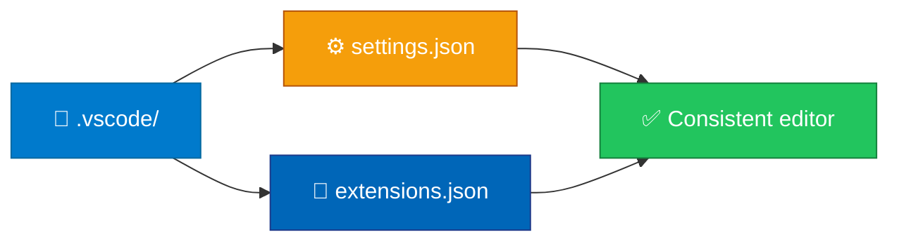

<p align="center">
  
</p>

<h1 align="center">vscode-settings-shared</h1>

<p align="center">
  <strong>EN</strong> Shared settings.json and extensions.json recommendations<br/>
  <strong>PT</strong> settings.json e extensions.json partilhados
</p>

<p align="center">
  <a href="https://github.com/manansbdb/vscode-settings-shared/blob/main/LICENSE"></a>
  
  
  <a href="#support--apoio"></a>
</p>

---

## What it does / Para que serve

| English | Português |
|---------|-----------|
| Shared **VS Code** workspace `settings.json` and recommended `extensions.json`, plus notes. | **VS Code** `settings.json` e `extensions.json` recomendados, com notas. |
| Copy into `.vscode/` so the team gets the same editor defaults. | Copia para `.vscode/` para a equipa partilhar defaults do editor. |



---

## Install / Instalação

### 1) Clone / Clona

```bash
git clone https://github.com/manansbdb/vscode-settings-shared.git
cd vscode-settings-shared
```

### 2) Apply / Aplica

```bash
mkdir -p /path/to/your-project/.vscode
cp .vscode/settings.json /path/to/your-project/.vscode/
cp .vscode/extensions.json /path/to/your-project/.vscode/
cp NOTES.md /path/to/your-project/docs/vscode-notes.md
```

### Requirements / Requisitos

- `git`
- Visual Studio Code or compatible editor

---

## Quick start / Início rápido

```bash
git clone https://github.com/manansbdb/vscode-settings-shared.git
mkdir -p .vscode
cp vscode-settings-shared/.vscode/* .vscode/
```

---

## Contents / Conteúdos

| Path | Purpose / Função |
|------|------------------|
| `.vscode/settings.json` | Workspace settings |
| `.vscode/extensions.json` | Recommended extensions |
| `NOTES.md` | Usage notes |
| `SUPPORT.md` | Donations / Doações |

---

## Project layout / Estrutura

```text
vscode-settings-shared/
├── docs/banner.svg
├── .vscode/settings.json
├── .vscode/extensions.json
├── NOTES.md
├── SUPPORT.md
└── README.md
```

---

## Support / Apoio

Bitcoin donations welcome / Doações em Bitcoin bem-vindas:

```
bc1q0qfnlnxyum9u45stzxe0a7jnhtj4j0usfkqdjw
```

See [SUPPORT.md](./SUPPORT.md).

---

## License / Licença

[MIT](./LICENSE) © 2026 manansbdb
